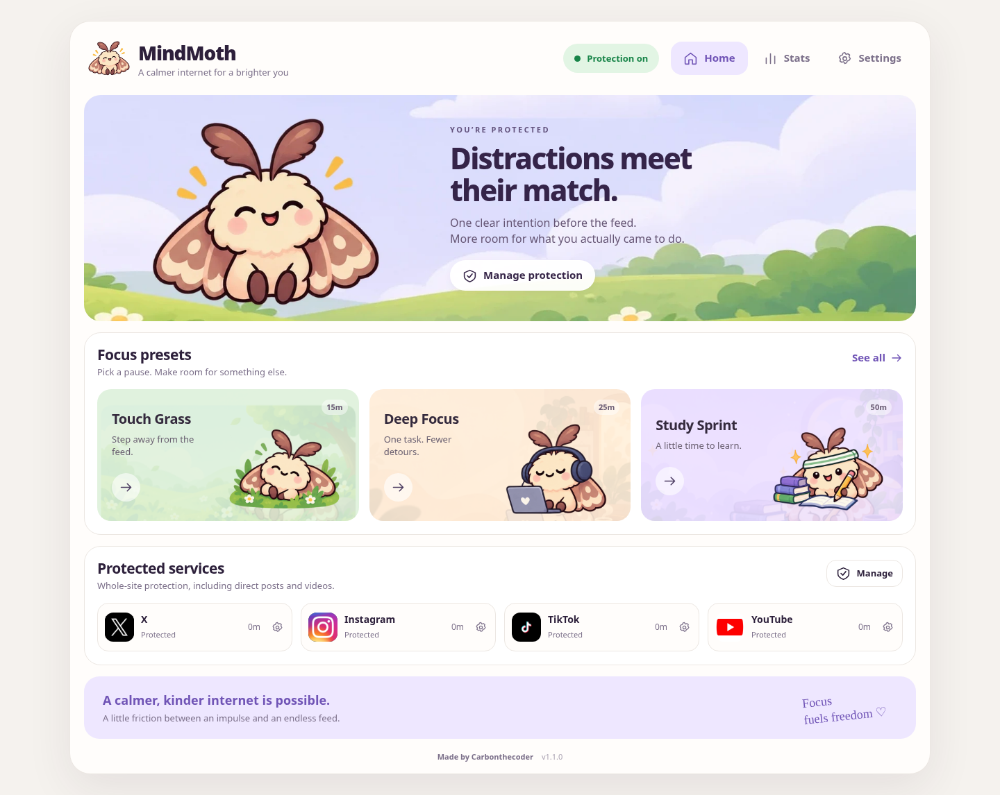

# MindMoth

A free, local-first browser extension that puts deliberate friction between an impulse and an endless feed.

**Live site:** [https://mindmoth.vercel.app](https://mindmoth.vercel.app)

**1.1.0 Public Beta.** Designed for desktop Chromium browsers, including Chrome and Opera GX. This is an unpacked beta, not a browser-store listing or tamper-proof device manager.

[Get started](docs/INSTALL.md) · [How it works](docs/ARCHITECTURE.md) · [Privacy](PRIVACY.md) · [Contribute](CONTRIBUTING.md)



## Install

Download the extension ZIP and extract it to a permanent folder. In your browser's extensions page, enable **Developer mode**, choose **Load unpacked**, and select the folder containing `manifest.json`.

From a source download, select the **`src`** directory instead. No npm install, desktop runtime, account or API key is needed to use the extension.

Chrome: `chrome://extensions`. Opera GX: `opera://extensions`. Edge: `edge://extensions`.

**Updating an existing installation:** copy the new extension files into the same folder already loaded by the browser. Click **Reload** on that extension, then refresh the dashboard and protected website tabs. Do not remove/reinstall the extension to update it if you want to preserve its extension ID and data.

## What it does

- Whole-domain interventions for X (including Twitter aliases), Instagram, TikTok, and YouTube (including `youtu.be`).
- Stated intentions, written reflections, timed reading, active waits, short allowances and held confirmations.
- Aggressive mode allows at most 90 seconds for a purposeful visit, or 30 seconds for scrolling. Repeat unlocks lead to 15, 30 or 60 minute cooldowns.
- Focus sessions lock all four services. Finishing a timer counts a session; ending early does not.
- A compact toolbar popup, dashboard, seven moth health stages, recorded milestones, dark mode by default, and a light theme.
- Reviewed exceptions: a pause takes a 5 minute cooling-off review; turning off takes 10 minutes. Both require three typed answers, 60 seconds of active reading, an exact phrase and an 8 second continuous hold. A successful pause lasts 10 minutes, then protection returns.
- Early focus cancellation, reducing intervention strength, and resetting data also have review flows.
- All assets ship locally. No telemetry, no account, no remote model, no localhost server.

The focus-health score is a playful usage indicator, not a medical measurement. Missing days are not counted as perfect days. Each milestone states what it actually measures.

## Important limits

MindMoth cannot prevent a user from disabling/uninstalling it through browser controls, using another profile/browser, or editing its source. Private-window protection requires the browser's own permission. It does not block Windows or mobile apps, and data does not sync between browsers. A device/browser must run for alarms and tracking to operate; absolute deadlines are rechecked when it resumes.

## Development

The extension uses plain HTML/CSS/ES modules with no runtime dependencies or build step.

```sh
npm test
python tools/check_release.py
python tools/package_extension.py
```

Node 20+ and Python 3.10+ are development tools only. For the Chromium DOM test harness:

```sh
python -m pip install -r requirements-dev.txt
python -m playwright install chromium
python tests/browser_harness.py
```

The harness renders the real modules and exercises real DOM controls using a simulated extension-API and tab-focus adapter. It is **not a native installed-extension or Opera GX test**. See [testing scope](docs/TESTING.md) and the checked-in test result file.

## Website

The product site is hosted at **[https://mindmoth.vercel.app](https://mindmoth.vercel.app)**. Site source is not part of this open-source repository. Download CTAs on the live site point to [this repository](https://github.com/carbongotfound/MindMoth).

## Licence

Code: Apache License 2.0. See [LICENSE](LICENSE). Please keep attribution (including README credit) when you redistribute or fork.

Third-party service logos remain their owners' marks and are not granted under this licence. See [asset provenance](docs/ASSETS.md).

Made by [Carbonthecoder](https://x.com/Carbonthecoder).